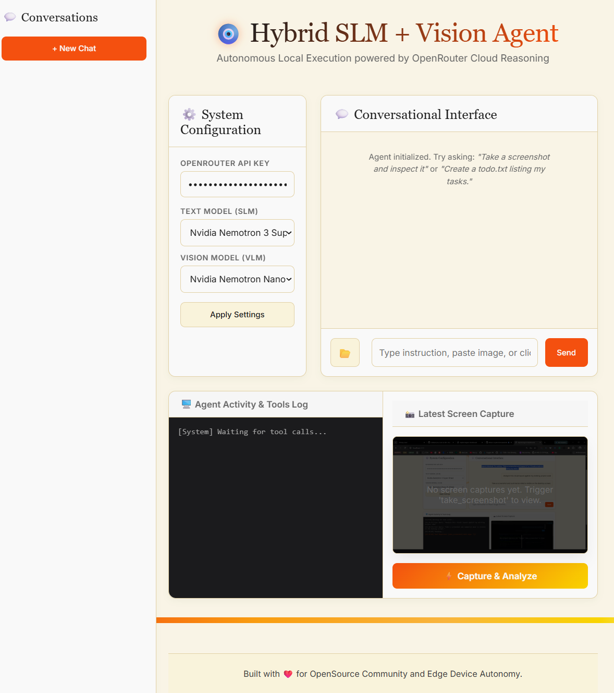

</p>

<h1 align="center">🧿 Hybrid SLM + Vision Agent for Edge Devices</h1>
<p align="center">
  A state-of-the-art visual and conversational assistant that communicates with cloud APIs (via OpenRouter) to autonomously inspect, create, and modify text/code files directly in your local desktop workspace.
</p>

---

## 🎨 System Walkthrough & Screenshots

**1. Initial Dashboard Layout**  
 

---

## 🚀 Key Features

* **Visual Clipboard Pasting**: Paste cropped UI layouts or snippets directly from Chrome or your Snipping Tool (`Ctrl + V`) into the chat input with instantaneous visual thumbnail previews.
* **Two-Step Vision-to-Action Pipeline**:
  1. **Perception**: Calls `nvidia/nemotron-nano-12b-v2-vl:free` to extract layout structure and specs from the image.
  2. **Action**: Pipes the visual context to `nvidia/nemotron-3-super-120b-a12b:free` (Text SLM) to execute local workspace tools.
* **Premium Dashboard UI**: Rich dark mode, glassmorphic card layouts, responsive inputs, and SVG scroll-driven line drawing based on StitchMCP design tokens.
* **Local Tools Execution**: Autonomously invokes `write_file`, `read_file`, and `take_screenshot` directly in the local workspace directory.
* **Security & Layout Protection**: Encoded text inputs and sanitized HTML outputs protecting the dashboard against script injection and layout breakage.

---

## ⚙️ Tech Stack & AI Stack

<table align="center">
<tr>

<td align="center" width="120" style="padding:10px;">
FastAPI <br><br>
<a href="https://fastapi.tiangolo.com/" target="_blank">

</a>
</td>

<td align="center" width="120" style="padding:10px;">
Uvicorn <br><br>
<a href="https://www.uvicorn.org/" target="_blank">

</a>
</td>

<td align="center" width="120" style="padding:10px;">
OpenRouter <br><br>

</td>

<td align="center" width="120" style="padding:10px;">
Nvidia Nemotron <br><br>

</td>

<td align="center" width="120" style="padding:10px;">
Meta Llama <br><br>

</td>

<td align="center" width="120" style="padding:10px;">
Agentic AI <br><br>

</td>

</tr>
</table>

---

## 💻 Languages & Tools

<table align="center">
<tr>

<td align="center" width="120" style="padding:10px;">
Python <br><br>
<a href="https://www.python.org" target="_blank">

</a>
</td>
<td align="center" width="120" style="padding:10px;">
GitHub <br><br>

</td>

<td align="center" width="120" style="padding:10px;">
JavaScript <br><br>
<a href="https://developer.mozilla.org/en-US/docs/Web/JavaScript" target="_blank">

</a>
</td>

<td align="center" width="120" style="padding:10px;">
HTML5 <br><br>
<a href="https://www.w3.org/html/" target="_blank">

</a>
</td>

<td align="center" width="120" style="padding:10px;">
CSS3 <br><br>
<a href="https://www.w3schools.com/css/" target="_blank">

</a>
</td>


</tr>
</table>

---


## 💻 Integrated Development Environment

<table align="center">
<tr>

<td align="center" width="120" style="padding:15px;">
VS Code <br><br>
<a href="https://code.visualstudio.com/" target="_blank">

</a>
</td>

<td align="center" width="120" style="padding:15px;">
Antigravity <br><br>
<a href="https://antigravity.google/" target="_blank">

</a>
</td>

<td align="center" width="120" style="padding:15px;">
PyCharm <br><br>
<a href="https://www.jetbrains.com/pycharm/" target="_blank">

</a>
</td>

<td align="center" width="120" style="padding:15px;">
KIRO  <br><br>
<a href="https://kiro.dev/" target="_blank">

</a>
</td>

</tr>
</table>

---

## 🛠️ Installation & Usage

### 1. Clone & Navigate to Project Workspace
```powershell
git clone https://github.com/Bibek-Gupta14/OcularSLM
```

### 2. Configure Environment Variables
Create a `.env` file in the root directory:
```env
OPENROUTER_API_KEY=your_openrouter_api_key_here
```

### 3. Install Python Dependencies
```powershell
pip install -r requirements.txt
```

### 4. Run the Local server
```powershell
python server.py
```

### 5. Launch UI Dashboard
Open your favorite web browser and go to `http://localhost:8000`.

---
